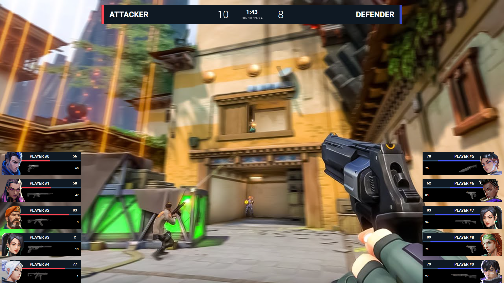

<p align="center">
	<p align="center" style="font-weight:600; letter-spacing:1pt; font-size:20pt;">LEXOGRINE HUD</p>
	<p align="center"></p>
	<p align="center" style="font-weight:400;">Powered by <a href='https://github.com/lexogrine/hud-manager'><strong>« LHM.gg »</strong></a></p>
</p>

# Lexogrine HUD

  

Fullfledged example of the React HUD made for LHM. It has:

- Custom actions
- Keybinds
- Player cam feed
- Scoreboard

## Keybinds:
### **Left Alt + C**
> Toggles scoreboard


## Preview



# Download

This HUD is available to download by default in the [LHM](https://lhm.gg)

# Instruction
## Setting up
Fork this repo, clone it, and then run `npm install` and `npm start`. HUD should start on the 3500 port. For this to work have LHM opened so it will pass Valorant data to the HUD.

## Identifying HUD
In `/public` directory edit hud.json so it fits you - fill HUD's name, author, version, specify the radar and killfeed functionalities. At the end replace the thumb.png with your icon :)

## Building & distributing
To build version to distribute and move around, in the root directory run `npm run pack`. It will create the zip file for distribution. Now you can just drag and drop this file into the LHMs upload area.

## Signing

To create Signed HUD to prevent at least from modyfing compiled Javascript files run `npm run sign`. It's the same as `npm run pack` command but with additional step of signing .js and .css files and hud.json.

  
 ## File structure
 The HUD is seperated into two parts - the API part, that connects to the LHM API and communicate with it: `src/App.tsx` file and `src/api` directory. Usually, you don't want to play with it, so the whole runs without a problem.
 The second part is the render part - `src/HUD`, `src/fonts` and `src/assets` are the directories you want to modify. In the `src/HUD` each element of the HUD is seperated into its own folder. Styles are kept in the `src/HUD/styles`. Names are quite self-explanatory, and to modify style of the element you should just find  the styling by the file and class name.


## `panel.json` API
To get the incoming data from the LHM, let's take a look at the `src/HUD/SideBoxes/SideBox.tsx` component:
```typescript
const Sidebox = ({side, hide} : { side: 'left' | 'right', hide: boolean}) => {
    const [ image, setImage ] = useState<string | null>(null);
    const data = useConfig('display_settings');

    useOnConfigChange('display_settings', data => {
        if(data && `${side}_image` in data){
            const imageUrl = `${apiUrl}api/huds/${hudIdentity.name || 'dev'}/display_settings/${side}_image?isDev=${hudIdentity.isDev}&cache=${(new Date()).getTime()}`;
            setImage(imageUrl);
        }
    }, []);

    if(!data || !data[`${side}_title`]) return null;
    return (
        <div className={`sidebox ${side} ${hide ? 'hide':''}`}>
            <div className="title_container">
                <div className="title">{data[`${side}_title`]}</div>
                <div className="subtitle">{data[`${side}_subtitle`]}</div>
            </div>
            <div className="image_container">
                {image ? :null}
            </div>
        </div>
    );
}
```

You can just read data from the HUDs settings by using `useConfig` hook. Everything is now strictly typed. If you make a change to panel or keybinds JSON files, Vite server will automatically generate types for you, so useConfig should always be up to date.

If you want to listen for a change in settings, you can use `useOnConfigChange`. In this case we are using this to force refresh `src` attribute of the img element.

If you want to listen for action input, you can just use `useAction` hook, like here in Trivia.tsx:
```typescript
useAction('triviaState', (state) => {
   setShow(state === "show");
});
```
For the action input we need to import the `actions` object and create listener with the parameter on it.
## `keybinds.json` API
Keybinds API works in very similiar to `panel.json` action API. This time the example will be from `RadarMaps.tsx`:
```typescript
useAction('radarBigger', () => {
   setRadarSize(p => p+10);
}, []);

useAction('radarSmaller', () => {
   setRadarSize(p => p-10);
}, []);
```


